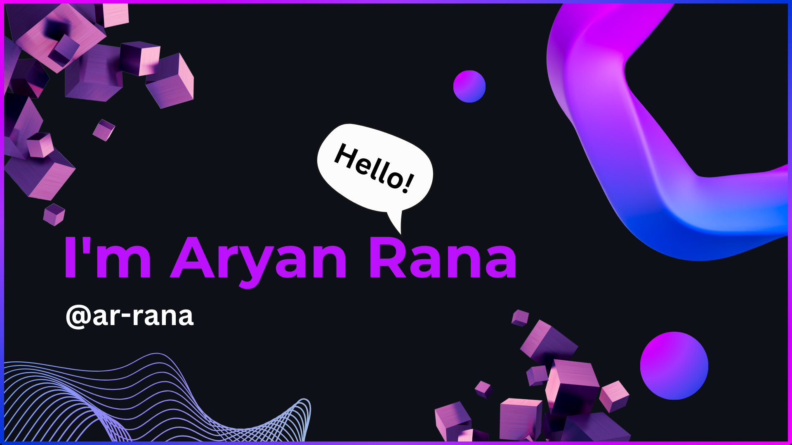

<h1 align="center"></h1>
- 🌱 I’m currently learning Java and Cloud Technologies
 
- 💞️ I’m looking to collaborate on Open Source Projects

<h3 align="left">Connect with me:</h3>

  
  
  
  

  
  
   
<!-- 
&nbsp;

 -->
<!---
ar-rana/ar-rana is a ✨ special ✨ repository because its `README.md` (this file) appears on your GitHub profile.
You can click the Preview link to take a look at your changes.
--->
